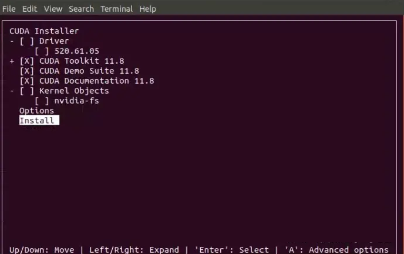

# Create an Ubuntu Environment with GPU, CUDA, cuDNN, Python, TensorFlow

## Environment Parameter

| Object     | version   | describer                                   |
| ---------- | --------- | ------------------------------------------- |
| Ubuntu     | 20.04 LTS | 限制python, C编译器版本                      |
|Nvidia Drivers|470|受限于GPU型号。|
| tensorflow | 2.12.0    | 限制numpy。                                  |
| python     | 3.8-3.11  | 受限于ubuntu版本，20.04自带版本为3.8。限制DGL, tensorflow版本。   |
| GCC        | 9.4.0     | Ubuntu 20.04 LTS 自带GCC版本                 |
| Clang      | 16.0.0    | 不使用。                               |
| Bazel      | 5.3.0     |                                             |
| CUDA       | 11.8      | 受限于ubuntu, python版本。                   |
| cuDNN      | 8.6       | 受限于ubuntu, python版本                     |
| DGL        | 1.1.2     | 限制了python, tensorflow版本。               |
| numpy      |           |                                             |
| pandas     |           | 限制numpy版本。                             |
| matplotlib |           | 可视化, 限制numpy版本。                             |
| scikit-learn |           | 机器学习框架                          |
| xgboost    |           | xgboost框                                |
| networkx   |           | 复杂网络                                 |
|gensim||小型机器学习模型库|
|imageio||图片处理|
|pillow||图片处理|
|gym||强化学习环境|
|geopy||地图|

## Step

主要思路是：先装底层，再装应用。

安装nvidia驱动->安装CUDA->安装cuDNN->安装tensorflow

|编号|步骤|命令|说明|
|---|---|---|---|
|1|安装ubunt|/|/|
|1.1|安装ubunt|/|建议选择中文键盘，系统语言可以选择英语。|
|1.2|安装ubunt|/|一定要选择服务器指定的启动盘。|
|1.3|安装ubunt|/|一定要把所有的硬盘都删除分区，不然很难选择挂载选项。|
|1.4|安装ubunt|/|安装时一行要选择“下载第三方组件...”，不然系统无法启动。|
|2|更新ubunut|/|/|
|2.1|修改软件源| gedit /etc/apt/sources.list |修改之前建议先备份一次。修改的内容[清华软件源内容](#tsinghua-software-sources)。|
|2.2|更新apt| apt upgrade ||
|2.3|更新apt| apt update ||
|2.4|更新之后需要重启一次。| reboot |可以和挂载硬盘、修改屏幕分辨率之后一起重启。|
|3|挂载非引导硬盘。|/|/|
|3.1|进入根目录| cd / |/|
|3.2|创建工作空间目录| mkdir [MountPath] |[MountPath]是硬盘被挂载的路径。举例：/workspace|
|3.3|查看硬盘情况| fdisk -l 或者使用 lsblk 命令 |lsblk显示的清晰清晰许多。在不需要查看详细信息的时候建议使用，缺点是无法看到硬盘的路径。|
|3.4|格式化磁盘并写入文件系统| mkfs.ext4 /dev/HardDiskID |/dev/HardDiskID是硬盘路径。这个路径只能通过fdisk -l来查看。举例：/dev/sda。它是机械硬盘对应的路径。|
|3.5|挂载硬盘| mount  /dev/HardDiskID [MountPath] |/dev/HardDiskID是硬盘路径。这个路径只能通过fdisk -l来查看。举例：/dev/sda。它是机械硬盘对应的路径。[MountPath]是硬盘被挂载的路径。|
|3.6|查看硬盘信息| df -h |/|
|3.7|设置开机自动挂载| gedit /etc/fstab |/|
|3.8|在/etc/fstab最后添加一行内容为：/dev/HardDiskID  [MountPath]  ext4  defaults 0  1|/|/dev/HardDiskID是硬盘路径。[MountPath]是硬盘被挂载的路径。|
|3.9|重启一次。| reboot |/|
|4|修改屏幕分辨率|/|目前只能修改为1024x768分辨率。而且很可能是在apt update之后才能生效。|
|4.1|打开grub文件| gedit /etc/default/grub ||
|4.2|修改屏幕分辨率| 修改"GRUB_GFXMODE=640x480"的内容为"GRUB_GFXMODE=1024x768"。 |/|
|4.3|重启一次。| reboot |/|
|5|修改"software & updates"|/|/|
|5.1|关闭"Notify me of a new Ubuntu version"|/|修改为never。不在提醒将当前的Ubuntu 20.04 LTS升级为22.04版本。|
|6|安装nvidia驱动|/|/|
|6.1|查看是否安装显卡| 注意转义字符："lspci \| grep -i nvidia" |注意为了表格显示这里使用了转义字符来显示竖杠。[查看是否安装显卡回显](#查看是否安装显卡61)|
|6.2|查看显卡信息| nvidia-smi |[查看推荐显卡驱动程序回显](#查看显卡信息62)|
|6.3|查看可以安装的nvidia驱动版本| ubuntu-drivers devices |[查看可以安装的nvidia驱动版本回显](#查看可以安装的nvidia驱动版本)。|
|6.4|安装驱动源| sudo add-apt-repository ppa:graphics-drivers/ppa |/|
|6.5|更新驱动源| sudo apt update |/|
|6.6|安装驱动| apt install nvidia-driver-470 |注意没有安装驱动和安装驱动之后的不同点在于：1. 没有安装驱动之前"Software & Updates"中"Additional Drivers"是无法看到具体可供选择安装的驱动版本的，只有最下面一个Proprietary...内容（不含驱动版本信息）被选中，其他选项均为灰色。安装驱动之后就可以看到可以选择具体安装的驱动版本了，并且已经选中recommended的驱动版本。2. 运行nvidia-smi显示的内容不同。没有安装驱动之前显示的内容虽然也是一个表格，但是无法看到明显的细节信息。安装驱动之后的显示的信息包含了NVIDIA-SMI, Driver Version, CUDA Version版本信息的表头了。显示内容的细致程度明显不一样。|
|6.7|重启| reboot |/|
|7|安装ubuntu必备软件|/|/|
|7.1|安装必备软件| apt install ipykernel openssh-server net-tools python3-pip vsftpd sysstat wget timeshift |[必备软件说明](#安装必备软件71)。注意ipykernel必须安装的，不然在vscode中的jupyter无法运行。|
|8|安装CUDA|/|/|
|8.1|查看ubuntu下CPU的架构| uname -m |x86_64架构。|
|8.2|选择CUDA版本|下载地址[https://developer.nvidia.com/cuda-toolkit-archive](https://developer.nvidia.com/cuda-toolkit-archive)|[对应的版本](#environment-parameter)|
|8.3|下载| sudo wget https://developer.download.nvidia.com/compute/cuda/11.8.0/local_installers/cuda_11.8.0_520.61.05_linux.run|下载。|
|8.4|安装| sudo sh cuda_11.8.0_520.61.05_linux.run|[CUDA安装过程](#cuda安装过程)。|
|8.5|查看CUDA安装情况| nvidia-smi |安装之前显示的CUDA版本是11.4，安装之后CUDA的版本为11.8。在没有安装成功cuda_11.8.0_520.61.05_linux.run的现象是/usr/local目录下是没有包含cuda名字的文件夹的。|
|9|配置CUDA环境变量|/|/|
|9.1|打开.bashrc文件|gedit ~/.bashrc |打开~/.bashrc文件。注意：当前环境中处于/home/[Account]目录下的.bashrc文件和~/.bashrc文件的内容并不一样。修改的是~/.bashrc文件。|
|9.2|最后添加环境变量| export PATH=$PATH:/usr/local/cuda-11.8/bin |/|
|9.3|最后添加环境变量| export LD_LIBRARY_PATH=$LD_LIBRARY_PATH:/usr/local/cuda-11.8/lib64 |/|
|9.4|最后添加环境变量| export LIBRARY_PATH=$LIBRARY_PATH:/usr/local/cuda-11.8/lib64 |此项可以不添加。|
|9.5|最后添加环境变量| export CUDA_HOME=$CUDA_HOME:/usr/local/cuda-11.8 |/|
|9.6|使用使得环境变量生效| source ~/.bashrc |/|
|9.7|验证是否生效。| nvcc -V |[CUDA安装生效](#cuda安装生效)|
|10|安装cuDNN|/|[安装cudnn的方法](#正确安装cudnn的方法)|
|10.1|需要在nvidia注册。|/|/|
|10.2|登录之后在<https://developer.nvidia.com/rdp/cudnn-archive>下载。|/|/|
|10.3|需要科学上网下载打开页面。然后不用科学上网的情况下载地址为：<https://developer.download.nvidia.cn/compute/cudnn/secure/8.6.0/local_installers/11.8/cudnn-local-repo-ubuntu2004-8.6.0.163_1.0-1_amd64.deb>。|/|下载地址有租期。过期之后无法继续下载。在科学上网的情况下很容易中途下载失败。通过科学上网先点开下载链接，然后切换到非科学上网状态，快速下载。基本上要求10分钟之内下载完成。|
|10.4|安装deb文件|sudo dpkg -i cudnn-local-repo-ubuntu2004-8.6.0.163_1.0-1_amd64.deb|在下载cudnn-local-repo-ubuntu2004-8.6.0.163_1.0-1_amd64.de文件的目录下运行。|
|10.5|导入CUDA GPG钥匙。安装完成cudnn-local-repo-ubuntu2004-8.6.0.163_1.0-1_amd64.deb之后的回显信息中会有完整的提示语句。| sudo cp /var/cudnn-local-repo-*/cudnn-local-*-keyring.gpg /usr/share/keyrings/ |/|
|10.6|更新apt。|sudo apt-get update|/|
|10.7|安装runtime库。| sudo apt-get install libcudnn8=8.6.0.163-1+cuda11.8 |没有安装runtime库, 开发库时，直接运行[](#测试代码)会使得tensorflow报包含"tensorflow coud not find cuda drivers on your machine."内容的错误。|
|10.8|安装开发库。| sudo apt-get install libcudnn8-dev=8.6.0.163-1+cuda11.8 |/|
|10.9|安装示例代码。| sudo apt-get install libcudnn8-samples=8.6.0.163-1+cuda11.8 |/|
|10.10|复制cuDNN示例到一个具有写权限的路径下。| cp -r /usr/src/cudnn_samples_v8/ $HOME |/|
|10.11|抵达具有写权限的路径下。| cd  $HOME/cudnn_samples_v8/mnistCUDNN |/|
|10.12|解决引入FreeImage.h的问题。| sudo apt-get install libfreeimage3 libfreeimage-dev |mnistCUDNN示例中引入了FreeImage.h。如果没有安装libfreeimage和libfreeimage-dev会报错“fatel error: FreeImage.h: 没有那个文件或目录”|
|10.13|编译mnistCUDNN示例。| make clean && make |/|
|10.14|运行mnistCUDNN示例。| ./mnistCUDNN |如果出现"Test passed！"的信息表示CUDA, cuDNN安装成功。|
|10.15|查看cudnn的版本| cat /usr/local/cuda-11.8/include/cudnn_version.h | grep CUDNN_MAJOR -A 2 |/|
|11|安装python库|/|/|
|11.1|修改pip软件源| pip config set global.index-url https://pypi.tuna.tsinghua.edu.cn/simple |修改为清华源。|
|11.2|安装包|tensorflow, pandas, numpy, matplotlib, scikit-learn, networkx, dgl, gensim, xgboost, gym, imageio, pillow, geopy|[python包版本](#environment-parameter)|
|12|安装vscode|/|/|
|12.1|安装所需插件|Jupyter, python, pylance, Chinese, Better Comments, autoDocstring, Excel Viewer, GitHub Theme, Markdow All in One, Markdown PDF, Rainbow CSV, vscode-pdf|/|
|13|测试代码|/|[测试代码](#测试代码)|
|13.1|选择python运行环境|/|使用usr/bin/python3下的编译环境。|

## Appends

### Tsinghua software sources

访问地址: <https://mirrors.tuna.tsinghua.edu.cn/help/ubuntu/>。

注意：
1. 一定要选择对应的ubuntu版本。
2. 建议选择“强制安全更新使用镜像”。安全性相关下载的内容就比较快。

```text
# 默认注释了源码镜像以提高 apt update 速度，如有需要可自行取消注释
deb https://mirrors.tuna.tsinghua.edu.cn/ubuntu/ focal main restricted universe multiverse
# deb-src https://mirrors.tuna.tsinghua.edu.cn/ubuntu/ focal main restricted universe multiverse
deb https://mirrors.tuna.tsinghua.edu.cn/ubuntu/ focal-updates main restricted universe multiverse
# deb-src https://mirrors.tuna.tsinghua.edu.cn/ubuntu/ focal-updates main restricted universe multiverse
deb https://mirrors.tuna.tsinghua.edu.cn/ubuntu/ focal-backports main restricted universe multiverse
# deb-src https://mirrors.tuna.tsinghua.edu.cn/ubuntu/ focal-backports main restricted universe multiverse

deb https://mirrors.tuna.tsinghua.edu.cn/ubuntu/ focal-security main restricted universe multiverse
# deb-src https://mirrors.tuna.tsinghua.edu.cn/ubuntu/ focal-security main restricted universe multiverse

# 预发布软件源，不建议启用
# deb https://mirrors.tuna.tsinghua.edu.cn/ubuntu/ focal-proposed main restricted universe multiverse
# # deb-src https://mirrors.tuna.tsinghua.edu.cn/ubuntu/ focal-proposed main restricted universe multiverse
```

### install graphics card driver

#### 查看是否安装显卡6.1

```log
04:00.0 VGA compatible controller: NVIDIA Corporation GM206 [GeForce GTX 960] (rev a1)
04:00.1 Audio device: NVIDIA Corporation GM206 High Definition Audio Controller (rev a1)
```

#### 查看显卡信息6.2

```log
Command 'nvidia-smi' not found, but can be installed with:

sudo apt install nvidia-utils-435         # version 435.21-0ubuntu7, or
sudo apt install nvidia-utils-440         # version 440.82+really.440.64-0ubuntu6
sudo apt install nvidia-340               # version 340.108-0ubuntu5.20.04.2
sudo apt install nvidia-utils-390         # version 390.157-0ubuntu0.20.04.1
sudo apt install nvidia-utils-450-server  # version 450.248.02-0ubuntu0.20.04.1
sudo apt install nvidia-utils-470         # version 470.199.02-0ubuntu0.20.04.1
sudo apt install nvidia-utils-470-server  # version 470.199.02-0ubuntu0.20.04.1
sudo apt install nvidia-utils-525         # version 525.125.06-0ubuntu0.20.04.3
sudo apt install nvidia-utils-525-server  # version 525.125.06-0ubuntu0.20.04.2
sudo apt install nvidia-utils-535         # version 535.86.05-0ubuntu0.20.04.2
sudo apt install nvidia-utils-535-server  # version 535.54.03-0ubuntu0.20.04.1
sudo apt install nvidia-utils-418-server  # version 418.226.00-0ubuntu0.20.04.2
```

#### 查看可以安装的nvidia驱动版本

显示信息如下，可以看到有一条中包含"recommended"的信息。这一条对应的就是推荐安装的驱动版本。

```log
== /sys/devices/pci0000:00/0000:00:1c.4/0000:04:00.0 ==
modalias : pci:v000010DEd00001401sv00001458sd000036B9bc03sc00i00
vendor   : NVIDIA Corporation
model    : GM206 [GeForce GTX 960]
driver   : nvidia-driver-525-server - distro non-free
driver   : nvidia-driver-535-server - distro non-free
driver   : nvidia-driver-418-server - distro non-free
driver   : nvidia-driver-535 - distro non-free recommended
driver   : nvidia-driver-470-server - distro non-free
driver   : nvidia-driver-525 - distro non-free
driver   : nvidia-driver-470 - distro non-free
driver   : nvidia-driver-390 - distro non-free
driver   : nvidia-driver-450-server - distro non-free
driver   : xserver-xorg-video-nouveau - distro free builtin
```


### 安装必备软件7.1

| 编号  | 软件                | 说明                                                                                                                 | 参考                                                                                                                            |
| ----- | ------------------- | -------------------------------------------------------------------------------------------------------------------- | ------------------------------------------------------------------------------------------------------------------------------- |
| 1必须 | openssh-server      | ubuntu上的SSH服务。                                                                                                  | <>                                                                                                                              |
| 2必须 | sysstat             | 主要用途是观察服务负载，比如CPU和内存的占用率、网络的使用率以及磁盘写入和读取速度等。                                | [https://blog.csdn.net/sixisixsix/article/details/106430379](https://blog.csdn.net/sixisixsix/article/details/106430379)           |
| 3必须 | net-tools           | 网络工具集，包含ifconfig命令等。                                                                                     | <>                                                                                                                              |
| 4必须 | python3-pip         | python中的pip管理工具。                                                                                              | <>                                                                                                                              |
| 5必须 | vsftpd         | ftp工具。                                                                                              | <>                                                                                                                              |
| 6必须    | wget                |访问网络资源| <> |
| 7必须    | timeshift                |备份工具|<>|
| 8    | gawk                | 主要就是用来在大的数据中提取中自己需要的元素（对文本数据的每行进行处理），然后将其格式化，使得重要的数据更易于阅读。 | [https://blog.csdn.net/weixin_42119041/article/details/108735906](https://blog.csdn.net/weixin_42119041/article/details/108735906) |
| 9     | bc                  | bc 命令是任意精度计算器语言，通常在linux下当计算器用。                                                               | [https://www.runoob.com/linux/linux-comm-bc.html](https://www.runoob.com/linux/linux-comm-bc.html)                                 |
| 10    | unzip               | zip文件压缩、解压缩工具。                                                                                            | [https://www.cnblogs.com/cy0628/p/13903990.html](https://www.cnblogs.com/cy0628/p/13903990.html)                                   |
| 11     | wget                | 下载文件的工具。                                                                                                     | [https://blog.csdn.net/feng98ren/article/details/102505662](https://blog.csdn.net/feng98ren/article/details/102505662)             |
| 12     | iptables-persistent | 暂时用不到。iptables是一个linux下的防火墙工具，它能帮助我们基于规则进行网络流量控制。                                | [https://zhuanlan.zhihu.com/p/574057147](https://zhuanlan.zhihu.com/p/574057147)                                                   |
| 13    | psmisc              | 暂时用不到。                                                                                                         | <>                                                                                                                              |
| 14    | docker-compose      | 暂时用不到。                                                                                                         | <>|
| 15推荐    | flameshot | 截图工具 | <>|


### CUDA安装过程

1. 选择Continue。
2. 填入accept。
3. 因为之前已经安装的nvidia的驱动，所以这里不用再选在Driver选项。其中CUDA Toolkit 11.8是必须的，其他的可选。这里是都选了。注意图片里面显示的是10.2的版本。在本机安装的是11.8版本。。注意在11.8的版本中，对于nvidia-fs可以不用安装。**提示信息中会出现：CUDA 11.8需要nvidia驱动版本为540以上，而ubuntu推荐的nvidia显卡驱动版本为nvidia-driver-470。忽略这个提示！！！**
4. 注意事项：
   1. 在ssh端无法显示上述安装步骤。只能在本机安装。
   2. 安装的过程没有任何进度显示。只有最后安装完成之后有信息输出。过程需要大约5分钟的时间。
   3. 在没有安装成功cuda_11.8.0_520.61.05_linux.run的现象是/usr/local目录下是没有包含cuda名字的文件夹的。
   4. 之后才能对环境变量进行配置。

### CUDA安装生效

安装成功的情况下输出信息如下：

```log
nvcc: NVIDIA (R) Cuda compiler driver
Copyright (c) 2005-2022 NVIDIA Corporation
Built on Sun_Sep_21_10:33:58_PDT_2022
Cuda compilation tools, release 11.8, V11.8.89
Build cuda_11.8.r11.8/compiler.31833905_0
```

在没有安装成功的情况下，会提示没有nvcc命令。系统提示：

```shell
Command 'nvcc' not found, but can be installed with: 
sudo apt install nvidia-cuda-toolkit
```

### 正确安装cudnn的方法

中文参考：<https://zhuanlan.zhihu.com/p/633849099>。
官方参考：cuDNN的安装官方文档进行安装：[NVIDIA cuDNN Documentation的1.3.2部分的内容为ubuntu上使用deb的正确安装方法](https://docs.nvidia.com/deeplearning/cudnn/install-guide/index.html#installlinux-deb)。
安装libfreeimage3和libfreeimage-dev的原因参考:<https://zhuanlan.zhihu.com/p/376892078>。

1. 安装

```shell
sudo dpkg -i cudnn-local-repo-ubuntu2004-8.6.0.163_1.0-1_amd64.deb
sudo cp /var/cudnn-local-repo-*/cudnn-local-*-keyring.gpg /usr/share/keyrings/
sudo apt-get update
sudo apt-get install libcudnn8=8.6.0.163-1+cuda11.8
sudo apt-get install libcudnn8-dev=8.6.0.163-1+cuda11.8
sudo apt-get install libcudnn8-samples=8.6.0.163-1+cuda11.8
```

如果只安装cudnn-local-repo-ubuntu2004-8.6.0.163_1.0-1_amd64.deb而不安装libcudnn8=8.6.0.163-1+cuda11.8和libcudnn8-dev=8.6.0.163-1+cuda11.8，tensorflow就会出现下列类似错误。
```shell
2023-03-02 12:05:09.463343: I tensorflow/tsl/cuda/cudart_stub.cc:28] Could not find cuda drivers on your machine, GPU will not be used.
2023-03-02 12:05:09.489911: I tensorflow/tsl/cuda/cudart_stub.cc:28] Could not find cuda drivers on your machine, GPU will not be used.
2023-03-02 12:05:09.490522: I tensorflow/core/platform/cpu_feature_guard.cc:182] This TensorFlow binary is optimized to use available CPU instructions in performance-critical operations.
To enable the following instructions: AVX2 FMA, in other operations, rebuild TensorFlow with the appropriate compiler flags.
2023-03-02 12:05:10.066759: W tensorflow/compiler/tf2tensorrt/utils/py_utils.cc:38] TF-TRT Warning: Could not find TensorRT

Tensorflow version = 2.12.0-dev20230203

2023-03-02 12:05:10.748675: I tensorflow/compiler/xla/stream_executor/cuda/cuda_gpu_executor.cc:996] successful NUMA node read from SysFS had negative value (-1), but there must be at least one NUMA node, so returning NUMA node zero. See more at https://github.com/torvalds/linux/blob/v6.0/Documentation/ABI/testing/sysfs-bus-pci#L344-L355
2023-03-02 12:05:10.771263: W tensorflow/core/common_runtime/gpu/gpu_device.cc:1956] Cannot dlopen some GPU libraries. Please make sure the missing libraries mentioned above are installed properly if you would like to use GPU. Follow the guide at https://www.tensorflow.org/install/gpu for how to download and setup the required libraries for your platform.
Skipping registering GPU devices...
```

2. 验证

官方验证参考：<https://docs.nvidia.com/deeplearning/cudnn/install-guide/index.html#verify>。

```shell
cp -r /usr/src/cudnn_samples_v8/ $HOME
cd  $HOME/cudnn_samples_v8/mnistCUDNN
sudo apt-get install libfreeimage3 libfreeimage-dev
make clean && make
./mnistCUDNN
```

### 测试代码

```python
import tensorflow as tf
from tensorflow.python.client import device_lib

print("TF version:", tf.__version__)
gpus = tf.config.list_physical_devices(device_type='GPU')
cpus = tf.config.list_physical_devices(device_type='CPU')
print(gpus, cpus)
print(device_lib.list_local_devices())

```

下面测试代码已经不再使用：
```python
import tensorflow as tf
tf.test.is_gpu_available()
```

## References

### 关于cuDNN的说明

来源：<https://zhuanlan.zhihu.com/p/630067986>

cuDNN（CUDA Deep Neural Network Library）是一个针对深度学习应用优化的加速库，它使用CUDA技术加速深度神经网络的训练和推断。这个库提供了一些高效的原语，例如卷积、池化、归一化等，可以帮助开发人员快速实现深度神经网络，并且提升训练和推断的速度。

CUDA和cuDNN是两个相互依赖的软件包，它们之间有以下关系：

- CUDA是必需的：cuDNN需要依赖于CUDA才能够工作。因为cuDNN是使用CUDA技术实现的，所以只有支持CUDA的硬件和系统才能够运行它。在安装cuDNN之前，必须先安装CUDA，并且在环境变量中设置CUDA的路径。
- cuDNN是可选的：尽管cuDNN可以提升深度学习应用的性能和效率，但它并不是必需的。如果不使用cuDNN，仍然可以使用CUDA进行深度学习计算。cuDNN只是一个可选的加速库，可以根据需要选择是否使用它。
- cuDNN提供了深度学习相关的API和方法：为了使开发人员更容易地使用cuDNN，这个库提供了一些专门针对深度学习的API和方法，例如卷积、池化、归一化等。这些方法已经被高度优化，可以在支持CUDA的硬件上快速执行。

总的来说，CUDA提供了基础的GPU并行计算能力，而cuDNN则是在这个基础上为深度学习应用提供的高级的计算加速库。两者结合起来可以大幅提升深度学习应用的性能和效率。

首先在[https://developer.nvidia.com/cudnn 下载相应版本的cudnn](https://link.zhihu.com/?target=https%3A//developer.nvidia.com/cudnn)。这一步需要注册或者拥有英伟达账号。

然后，参考 cuDNN 的安装官方文档进行安装：[NVIDIA cuDNN Documentation](https://link.zhihu.com/?target=https%3A//docs.nvidia.com/deeplearning/cudnn/install-guide/index.html%23installlinux-tar)

**错误的**：虽然我是 Ubuntu，但是也按照 "1.3.1. Tar File Installation" 部分的讲解进行操作，而不按照"1.3.2. Debian Local Installation"的部分进行操作。


